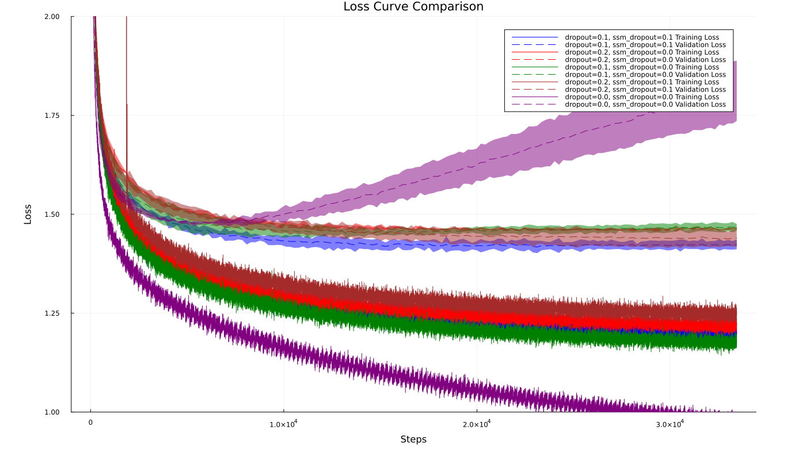

# Mamba SSM with SSM dropout

This repository contains:  
- **First Mamba SSM implementation in Julia** (as far as I know) using `Flux.jl` library.   
- **Optimized CUDA scan** minimizing global memory access, implemented with `CUDA.jl` library.
- **Scripts** to train the Mamba architecture on the following tasks:
    - Text generation on the tiny_shakespeare dataset with character level tokenization.
    - Classification on the sequential MNIST dataset (each image is treated as a sequence of pixels).
    - Retrieval task from the LRA benchmark.
- **Original SSM dropout** effective novel way of applying dropout in the Mamba architecture.

## Text generation on the tiny_shakespeare dataset
You can train your model using the following command: `julia train.jl shakespeare/mamba`. \
You can modify the training hyperparameters in the experiments/shakespeare/mamba file. \
If you only want to generate text, check the "generate_shakespeare_text.ipynb" notebook.

## MLFlow for experiment tracking
This repo supports experiment tracking using MLFlow. In order to use it, you have to:
- Install MLFlow server with the command `pip install mlflow`
- Launch the mlflow server on the 8080 port, for ex. you can launch it locally with `mlflow server --host 127.0.0.1 --port 8080`
- Launch the train script with the --use_mlflow flag, ex. `julia train.jl --use_mlflow shakespeare/mamba.jl`

## Comparison between normal dropout and SSM dropout
Here is the plot comparing the standard dropout with the SSM dropout on the tiny_shakespeare dataset. \

## References
Here is a list of resources and repos from which I have taken inspiration while realizing this project.
- [Original Mamba implementation](https://github.com/state-spaces/mamba) in Pytorch by Albert Gu and Tri Dao
- [mamba-minimal repo](https://github.com/johnma2006/mamba-minimal)
- [The Annotated S4](https://srush.github.io/annotated-s4/#experiments-mnist)
- [Mamba: The Hard Way](https://srush.github.io/annotated-mamba/hard.html)
